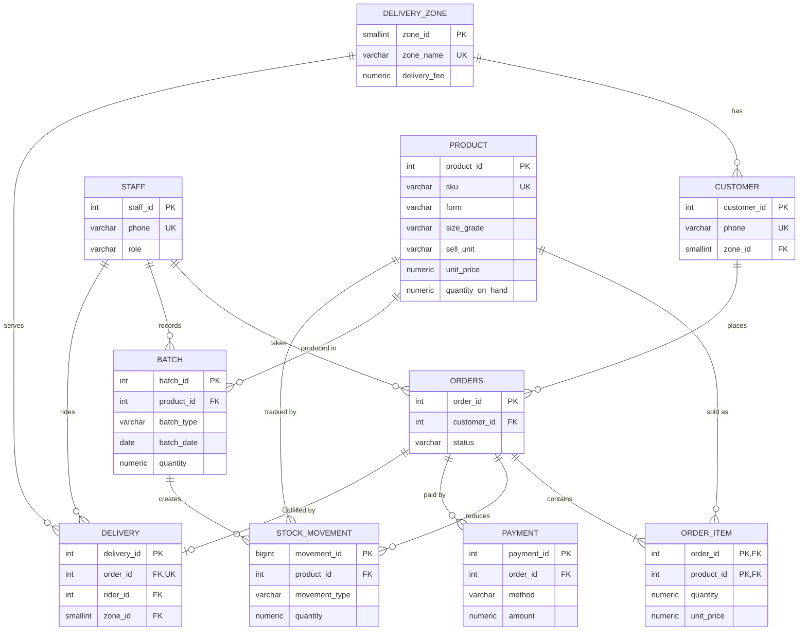

# ER Diagram: Josh Kay's Fisheries

Paste this into any Mermaid renderer (GitHub renders it automatically), then export a PNG into this folder as `er-diagram.png`.

```mermaid
erDiagram
    DELIVERY_ZONE ||--o{ CUSTOMER : "has"
    DELIVERY_ZONE ||--o{ DELIVERY : "serves"
    CUSTOMER ||--o{ ORDERS : "places"
    STAFF ||--o{ ORDERS : "takes"
    STAFF ||--o{ BATCH : "records"
    STAFF ||--o{ DELIVERY : "rides"
    ORDERS ||--|{ ORDER_ITEM : "contains"
    PRODUCT ||--o{ ORDER_ITEM : "sold as"
    PRODUCT ||--o{ BATCH : "produced in"
    PRODUCT ||--o{ STOCK_MOVEMENT : "tracked by"
    BATCH ||--o{ STOCK_MOVEMENT : "creates"
    ORDERS ||--o{ STOCK_MOVEMENT : "reduces"
    ORDERS ||--o{ PAYMENT : "paid by"
    ORDERS ||--o| DELIVERY : "fulfilled by"

    DELIVERY_ZONE { smallint zone_id PK
        varchar zone_name UK
        numeric delivery_fee }
    CUSTOMER { int customer_id PK
        varchar phone UK
        smallint zone_id FK }
    STAFF { int staff_id PK
        varchar phone UK
        varchar role }
    PRODUCT { int product_id PK
        varchar sku UK
        varchar form
        varchar size_grade
        varchar sell_unit
        numeric unit_price
        numeric quantity_on_hand }
    BATCH { int batch_id PK
        int product_id FK
        varchar batch_type
        date batch_date
        numeric quantity }
    ORDERS { int order_id PK
        int customer_id FK
        varchar status }
    ORDER_ITEM { int order_id PK, FK
        int product_id PK, FK
        numeric quantity
        numeric unit_price }
    STOCK_MOVEMENT { bigint movement_id PK
        int product_id FK
        varchar movement_type
        numeric quantity }
    PAYMENT { int payment_id PK
        int order_id FK
        varchar method
        numeric amount }
    DELIVERY { int delivery_id PK
        int order_id FK, UK
        int rider_id FK
        smallint zone_id FK }
```
